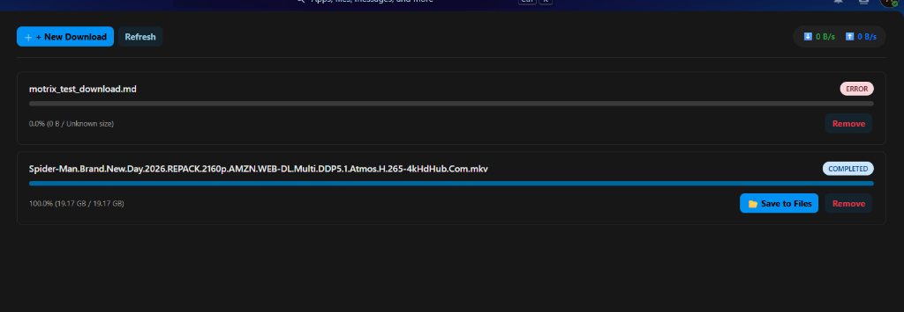
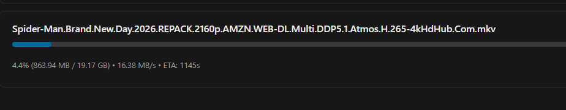

# ND Downloader for Nextcloud

[](LICENSE)
[](https://apps.nextcloud.com)
[](https://php.net)

**ND Downloader** is a Nextcloud application that offloads remote file downloads (HTTP/HTTPS, FTP, Magnet links, and BitTorrent files) to a dedicated, high-performance background download server. Once downloads finish, ND Downloader automatically streams and syncs them into the user's personal Nextcloud storage.

*Compatibility note: works with ND/aria2.*

---

## Screenshots

| Dashboard & Active Tasks | Admin Settings |
|:---:|:---:|
|  |  |

---

## Features

- **Multi-Protocol Download Management:** Download HTTP/HTTPS direct links, FTP files, BitTorrent `.torrent` files, and Magnet URIs.
- **Nextcloud Files Integration:** Start downloads directly from the Nextcloud Files `+ New` menu or drag-and-drop links directly into your Files view.
- **Universal Nextcloud Storage Support:** Fully decoupled from host disk paths via Nextcloud's Virtual Filesystem (`OCP\Files\`). Seamlessly compatible with **Local Storage**, **Amazon S3 / MinIO Object Storage**, and **External Storages**.
- **Per-User Isolation:** Each user has their own private download queue and cannot view or manipulate other users' downloads.
- **Security & SSRF Hardening:**
  - Token encryption at rest using Nextcloud's core `\OCP\Security\ICrypto`.
  - Built-in SSRF protection blocking loopback (`127.0.0.0/8`, `::1`), zero/unspecified, link-local, and cloud metadata endpoints (`169.254.169.254`, `metadata.google.internal`).
  - Administrator-configurable Domain Allowlist and Denylist policies.
  - Per-user rate limiting on download submissions and RPC actions.

---

## Architecture & Backend Protocol

ND Downloader communicates with an external **ND / Motrix download server** container via its **`/mdxp` JSON-RPC 2.0** protocol:

```
[ Nextcloud Client ]
        │  (HTTPS)
        ▼
[ Nextcloud Server ] ─── JSON-RPC (/mdxp) ───► [ ND Server Container ]
  (ND Downloader App)                                 │
        ▲                                            │ Downloads file
        │ Streams completed file via VFS             ▼
  [ Nextcloud User Storage ] ◄────────────── [ Shared /downloads Volume ]
 (Local Disk / S3 / MinIO)
```

> **Note on Protocol:** The backend daemon exposes `/mdxp` JSON-RPC 2.0 methods (`engine/status`, `stats/get`, `task/list`, `task/get`, `download/add`, `task/pause`, `task/resume`, `task/remove`). Standard vanilla `aria2c` daemons without the `/mdxp` interface are not directly compatible.

---

## Requirements

- **Nextcloud:** 28.0.0 – 31.x.x
- **PHP:** 8.1 – 8.4 (with `curl` and `openssl` extensions enabled)
- **ND Server:** A Docker container or server running the ND / Motrix download core.

---

## Quickstart: Docker Compose

The easiest way to run Nextcloud with ND Downloader is using standard Docker Compose with a shared volume for download staging:

```yaml
services:
  nextcloud:
    image: nextcloud:30-apache
    container_name: nextcloud
    restart: unless-stopped
    ports:
      - "8080:80"
    environment:
      - MYSQL_DATABASE=nextcloud
      - MYSQL_USER=nextcloud
      - MYSQL_PASSWORD=nextcloud_secret
      - MYSQL_HOST=db
    volumes:
      - nextcloud_data:/var/www/html
      - nd_downloads:/downloads:rw
    depends_on:
      - db
      - nd-server
    networks:
      - nextcloud_net

  db:
    image: mariadb:10.11
    container_name: nextcloud_db
    restart: unless-stopped
    environment:
      - MYSQL_ROOT_PASSWORD=root_secret
      - MYSQL_DATABASE=nextcloud
      - MYSQL_USER=nextcloud
      - MYSQL_PASSWORD=nextcloud_secret
    volumes:
      - db_data:/var/lib/mysql
    networks:
      - nextcloud_net

  nd-server:
    image: motrix/motrix-server:latest
    container_name: nd-server
    restart: unless-stopped
    ports:
      - "16801:16801"
    environment:
      - MOTRIX_PORT=16801
      - MOTRIX_SECRET=YOUR_SECURE_RPC_TOKEN_HERE
    volumes:
      - nd_downloads:/downloads:rw
    networks:
      - nextcloud_net

volumes:
  nextcloud_data:
  db_data:
  nd_downloads:

networks:
  nextcloud_net:
    driver: bridge
```

1. Start the stack: `docker compose up -d`
2. Complete Nextcloud setup at `http://localhost:8080`.
3. In Nextcloud's `config/config.php`, ensure private Docker network resolution is allowed:
   ```php
   'allow_local_remote_servers' => true,
   ```
4. In Nextcloud, navigate to **Administration Settings** &rarr; **ND Downloader**:
   - **Download Server URL:** `http://nd-server:16801`
   - **Default Download Directory:** `/downloads`
   - **Bearer Token:** `YOUR_SECURE_RPC_TOKEN_HERE`
5. Click **Test Connection** to verify connectivity.

---

## Pterodactyl Setup (Optional)

If you are hosting your Nextcloud instance or download daemon inside Pterodactyl panel containers:

1. **Port Allocation:** Allocate a primary port for the download server (e.g., `16801`).
2. **Mounts:** Configure a Pterodactyl Mount to share the download scratch folder between the ND container and Nextcloud's container directory (e.g., `/downloads`).
3. **Internal Networking:** If both containers share a Docker bridge or private host IP, point the **Download Server URL** to `http://<internal-ip>:<port>`.
4. **Watchdog Trigger (Optional):** If your container environment uses an external watchdog script, configure `start_trigger_path` in app config to trigger a reload when the engine start button is pressed.

---

## Administration & Security Settings

Navigate to **Administration Settings &rarr; ND Downloader**:

- **Download Server URL (`nddownloader_endpoint`):** Base URL of the `/mdxp` RPC server (e.g. `http://nd-server:16801`).
- **Default Download Directory (`nddownloader_save_dir`):** Staging directory inside the download container where in-progress downloads are written before being streamed to Nextcloud (default: `/downloads`).
- **Bearer Token (`nddownloader_token`):** Authentication secret. Encrypted using `\OCP\Security\ICrypto` authenticated AES encryption at rest.
- **Domain Allowlist (`domain_allowlist`):** Optional comma-separated list of permitted download domains (e.g., `*.archive.org, debian.org`). If specified, downloads from other domains are rejected.
- **Domain Denylist (`domain_denylist`):** Optional comma-separated list of prohibited domains.
- **Allow Private Network Subnets:** When disabled (recommended for production), blocks any download request targeting RFC1918 private IP ranges (`10.0.0.0/8`, `172.16.0.0/12`, `192.168.0.0/16`). Cloud metadata (`169.254.169.254`) and loopback (`127.0.0.1`, `::1`) are **always blocked unconditionally**.

---

## Troubleshooting

### Connection failed / Server unreachable
- Verify that the ND server container is running and listening on port `16801`.
- If Nextcloud runs in Docker and connects to another container or local host, verify that Nextcloud's `config/config.php` has:
  ```php
  'allow_local_remote_servers' => true,
  ```
- Test connectivity from within the Nextcloud container:
  ```bash
  docker exec -it nextcloud curl -i http://nd-server:16801/mdxp
  ```

### Authentication Failed (HTTP 401)
- Verify the secret configured in `MOTRIX_SECRET` or container environment matches the Bearer Token entered in Nextcloud Administration settings.

### Completed files not appearing in Nextcloud
- Verify that both containers share the exact same staging directory volume (e.g. `/downloads`).
- Ensure the Nextcloud web server user (`www-data`) has read and write permissions to the shared download directory.

---

## License & Third-Party Attribution

- **ND Downloader for Nextcloud** is licensed under the [GNU Affero General Public License v3.0 or later](LICENSE).
- Portions of the protocol structure and interface design are derived from [Motrix](https://github.com/agalwood/Motrix), licensed under the [MIT License](THIRD_PARTY_NOTICES.md).
